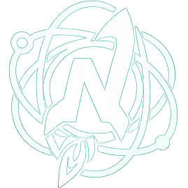

<div align="center">



# Nova Landings

**Landing page de alto impacto visual para servicios digitales**


</div>

---

## 📌 Descripción

Nova Landings es una landing page corporativa de diseño moderno y minimalista, optimizada para la conversión y la experiencia del usuario. Desarrollada para presentar servicios de creación y gestión de páginas web dirigidos a comercios y emprendedores que necesitan una presencia digital profesional.

El proyecto combina:
- **Diseño responsivo** que se adapta a cualquier dispositivo
- **Animaciones fluidas** que mejoran la experiencia visual
- **Tema oscuro elegante** con acentos en verde y azul
- **Estado estático** sin dependencias externas complejas

---

## 🎯 Propósito

Servir como página de presentación corporativa destacando:

✅ **Rapidez en la entrega** de proyectos web

✅ **Diseño cuidado y personalizado** para cada cliente

✅ **Precio competitivo** y transparente

✅ **Claridad absoluta** en la propuesta de valor

✅ **Servicios digitales integrales** (web, SEO, automatización)

---

## 🧩 Secciones Incluidas

| Sección | Descripción |
|---------|------------|
| **Hero** | Introducción clara con CTA principal y mockup interactivo |
| **Servicios** | Grid de 3 tarjetas con servicios clave |
| **Estadísticas** | Números destacados (experiencia, proyectos, clientes) |
| **Proceso de trabajo** | Timeline visual del flujo de trabajo |
| **Planes y precios** | 2 planes (básico y popular) con características detalladas |
| **Testimonios** | Grid de 3 opiniones de clientes con calificaciones |
| **FAQ** | Acordeón de preguntas frecuentes interactivo |
| **CTA Final** | Sección de cierre con llamada a acción |
| **Footer** | Links rápidos e información de contacto |

---

## 🛠️ Tecnologías

### Frontend
- **HTML5**: Estructura semántica
- **CSS3**:
  - Diseño responsive (mobile-first)
  - Animaciones y transiciones fluidas
  - Variables CSS para temas reutilizables
  - Glassmorphism y efectos modernos
- **JavaScript Vanilla**: Interactividad sin dependencias
  - Cursor personalizado
  - Menú hamburger responsivo
  - Acordeón FAQ dinámico
  - Scroll effects

### Recursos
- **Google Fonts**: Playfair Display & Outfit
- **SVG**: Ruido fractal como efecto de fondo
- **WebGL**: Efectos visuales (scene)

**100% estático** • Sin frameworks • Sin base de datos

---

## 📁 Estructura del Proyecto

```
NovaLandings/
├── index.html              # Página principal
├── style.css              # Estilos (comentados y organizados)
├── main.js                # Lógica interactiva
├── README.md              # Documentación
└── assets/
    ├── logo/
    └── favicon/
```

---

## 📊 Características Clave

| Feature | Descripción |
|---------|-----------|
| 🎯 **Cursor personalizado** | Anillo interactivo que responde al mouse |
| 🎬 **Animaciones fluidas** | Entrada escalonada con easing custom |
| 📱 **Mobile-first** | Optimizado para cualquier tamaño de pantalla |
| 🌙 **Tema oscuro** | Elegante y moderno para reducir fatiga ocular |
| ♿ **Accesibilidad** | Contraste suficiente, navegación clara |
| ⚡ **Rendimiento** | Sin librerías pesadas, carga instantánea |
| 🔍 **SEO-friendly** | HTML semántico, meta tags optimizados |
| 🎨 **Versátil** | Fácil de personalizar y escalar |

---

## 🎨 Diseño y Estilo

### Paleta de Colores
```
Fondo Primario:     #050508 (Negro muy oscuro)
Fondo Secundario:   #0a0a10 (Negro oscuro)
Tarjetas:           #111120 (Negro)

Acento Primario:    #00e5a0 (Verde Mint)
Acento Secundario:  #00c9ff (Azul Cian)
Acento Cálido:      #ff6b4a (Coral/Naranja)

Texto Primario:     #eeeef2 (Blanco suave)
Texto Secundario:   #8b8ba0 (Gris medio)
Texto Terciario:    #55556a (Gris oscuro)
```

### Tipografía
- **Headings**: Playfair Display (serif elegante)
- **Body**: Outfit (sans-serif moderno)
- **Tamaño base**: 16px con escalado fluido

### Animaciones Principales
| Animación | Descripción |
|-----------|------------|
| `slideUp` | Entrada escalonada desde abajo |
| `breathe` | Pulsación continua del logo |
| `mockupFloat` | Flotación 3D del mockup |
| `glowPulse` | Brillo pulsante |
| `shimmer` | Destello en elementos placeholder |

---

## 📱 Responsividad

### Breakpoints
```css
Desktop:  > 1024px   /* Grid de 3 columnas completo */
Tablet:   768-1024px /* Grid de 2 columnas, sin mockup */
Mobile:   < 768px    /* Columna única, menú hamburger */
```

**Características responsivas:**
- ✅ Menú hamburger en móviles
- ✅ Grid adaptable (3 col → 2 col → 1 col)
- ✅ Cursor personalizado deshabilitado en touch
- ✅ Padding y márgenes ajustados por pantalla
- ✅ Imágenes optimizadas para cada resolución

---

## 📚 Documentación CSS

El archivo `style.css` incluye **comentarios profesionales** en 12 secciones:

| Sección | Líneas | Descripción |
|---------|--------|------------|
| Variables y Temas | ~9-47 | Sistema de colores y tipografías |
| Estilos Base | ~49-99 | Reset global y scroll |
| Cursor Personalizado | ~108-160 | Anillo interactivo |
| Navegación | ~162-336 | Navbar con glassmorphism |
| Hero Section | ~338-369 | Sección principal |
| Animaciones | ~441-507 | Keyframes principales |
| Sistema de Botones | ~509-567 | Variantes glow y ghost |
| Servicios | ~836-919 | Grid de tarjetas |
| Precios | ~1002-1139 | Planes y características |
| Testimonios | ~1141-1215 | Grid de opiniones |
| FAQ | ~1217-1295 | Acordeón interactivo |
| Media Queries | ~1481-1620 | Responsive design |

---

## 🔧 Personalización

### Cambiar colores globales
Editar variables en `style.css` (línea ~16):
```css
:root {
  --accent: #00e5a0;      /* Tu color primario */
  --accent2: #00c9ff;     /* Tu color secundario */
  --text: #eeeef2;        /* Tu color de texto */
  /* ... */
}
```

### Cambiar tipografías
En `style.css`:
```css
--font-h: "Tu Fuente Serif", serif;
--font-b: "Tu Fuente Body", sans-serif;
```

### Personalizar contenido
Editar en `index.html` las secciones:
- Servicios
- Planes y precios
- Testimonios
- Preguntas frecuentes

---

## 📝 Licencia

Copyright © 2025 Nova Landings

---

<div align="center">

**Hecho con ❤️ para emprendedores y pequeños comercios**

[🌐 Ver en vivo](#) • [📧 Contacto](#) • [⭐ GitHub](#)

</div>
