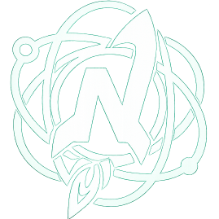

<div align="center">



# Nova Landings

**Landing page de alto impacto visual para servicios digitales**


</div>

---

## Descripcion

Nova Landings es una landing page corporativa de diseno moderno y minimalista, optimizada para la conversion y la experiencia del usuario. Desarrollada para presentar servicios de creacion y gestion de paginas web dirigidos a comercios y emprendedores que necesitan una presencia digital profesional.

El proyecto combina:
- **Diseno responsivo** que se adapta a cualquier dispositivo
- **Animaciones fluidas** que mejoran la experiencia visual
- **Tema oscuro elegante** con acentos en verde y azul
- **Estado estatico** sin dependencias externas complejas

---

## Proposito

Servir como pagina de presentacion corporativa destacando:

- **Rapidez en la entrega** de proyectos web
- **Diseno cuidado y personalizado** para cada cliente
- **Precio competitivo** y transparente
- **Claridad absoluta** en la propuesta de valor
- **Servicios digitales integrales** (web, SEO, automatizacion)

---

## Paginas del sitio

| Pagina | Archivo | Descripcion |
|--------|---------|-------------|
| **Home** | `index.html` | Pagina principal con hero, servicios, precios, testimonios, FAQ y CTA |
| **Portfolio** | `portfolio.html` | Grid de proyectos realizados con tarjetas interactivas |
| **Legal** | `legal.html` | Politica de privacidad y politica de cookies (contenido de Termly) |

---

## Secciones de la Home

| Seccion | Descripcion |
|---------|------------|
| **Hero** | Introduccion clara con CTA principal y mockup interactivo (desktop + mobile) |
| **Marquee** | Texto deslizante con servicios destacados |
| **Estadisticas** | Numeros destacados con animacion de contador |
| **Servicios** | Grid de 3 tarjetas con efecto 3D tilt |
| **Proceso de trabajo** | Timeline visual del flujo de trabajo |
| **Planes y precios** | 3 planes (Starter, Pro, Custom) con caracteristicas detalladas |
| **Testimonios** | Grid de 3 opiniones de clientes con calificaciones |
| **FAQ** | Acordeon de preguntas frecuentes interactivo con accesibilidad (aria-expanded) |
| **CTA Final** | Seccion de cierre con llamada a accion |
| **Footer** | Links rapidos, informacion de contacto y enlaces legales |

---

## Tecnologias

### Frontend
- **HTML5**: Estructura semantica con Open Graph y Twitter Cards
- **CSS3**:
  - Diseno responsive (mobile-first)
  - Animaciones y transiciones fluidas
  - Variables CSS para temas reutilizables
  - Glassmorphism y efectos modernos
- **JavaScript Vanilla**: Interactividad sin dependencias
  - Cursor personalizado con efecto hover
  - Menu hamburger responsivo
  - Acordeon FAQ dinamico con accesibilidad
  - Scroll reveal con IntersectionObserver
  - Efecto 3D tilt en tarjetas
  - Contador animado de estadisticas

### Recursos
- **Google Fonts**: Playfair Display & Outfit
- **SVG**: Ruido fractal como efecto de fondo
- **WebGL**: Red de particulas 3D interactiva

### Analitica y privacidad
- **Google Tag Manager**: Carga condicional por consentimiento de cookies
- **Banner de cookies GDPR**: Bloqueo de GTM hasta aceptacion explicita
- **Politicas legales**: Privacidad y cookies generadas con Termly

**100% estatico** — Sin frameworks — Sin base de datos

---

## Estructura del Proyecto

```
NovaLandings/
├── index.html              # Pagina principal (home)
├── portfolio.html          # Pagina de portfolio
├── legal.html              # Politica de privacidad y cookies
├── README.md               # Documentacion
├── css/
│   ├── base.css            # Variables, reset, body, scrollbar, ruido fondo
│   ├── components.css      # Cursor, nav, botones, footer, scroll reveal, marquee, CTA, cookies
│   ├── home.css            # Hero, mockups, stats, servicios, proceso, precios, testimonios, FAQ
│   ├── portfolio.css       # Estilos especificos del portfolio
│   └── legal.css           # Estilos especificos de la pagina legal (override Termly)
├── js/
│   ├── scene.js            # Red de particulas 3D (WebGL)
│   └── main.js             # Cursor, nav, scroll, hamburger, FAQ, contador, tilt, cookies
└── assets/
    ├── logo/               # Logos en formato PNG
    └── favicon/            # Favicon del sitio
```

### Organizacion del CSS

| Archivo   |   Contenido   |   Usado en   |
|-----------|---------------|--------------|
| `base.css` | Variables `:root`, reset, html/body, scrollbar, ruido SVG, `#scene` | Todas las paginas |
| `components.css` | Cursor, nav, hamburger, botones, footer, scroll reveal, marquee, CTA, cookie banner + media queries de componentes | Todas las paginas |
| `home.css` | Hero, mockups, stats, secciones, servicios, proceso, precios, testimonios, FAQ, back-to-top + media queries de home | Solo `index.html` |
| `portfolio.css` | Hero del portfolio, grid de proyectos, tarjetas de proyecto, link activo en nav | Solo `portfolio.html` |
| `legal.css` | Override de estilos Termly (`data-custom-class`), headings, listas, tablas para tema oscuro | Solo `legal.html` |

### Organizacion del JS

| Archivo | Contenido |
|---------|-----------|
| `scene.js` | IIFE con canvas WebGL: 100 particulas 3D conectadas por lineas, responsive, interactivo con el mouse |
| `main.js` | Cursor personalizado, nav scroll + glassmorphism, hamburger menu, scroll reveal, FAQ accordion, contador animado, smooth scroll, 3D tilt en tarjetas, banner de cookies GDPR |

---

## Caracteristicas Clave

| Feature | Descripcion |
|---------|-----------|
| **Cursor personalizado** | Anillo interactivo que responde al mouse y se expande en hover |
| **Particulas 3D** | Red de particulas WebGL con conexiones dinamicas |
| **Animaciones fluidas** | Entrada escalonada con easing custom (slideUp, mockupFloat, glowPulse) |
| **Mobile-first** | Optimizado para cualquier tamano de pantalla |
| **Tema oscuro** | Elegante y moderno para reducir fatiga ocular |
| **Accesibilidad** | Contraste suficiente, `aria-expanded` en FAQ, navegacion clara |
| **Rendimiento** | Sin librerias pesadas, carga instantanea |
| **SEO-friendly** | HTML semantico, meta tags, Open Graph, Twitter Cards |
| **GDPR compliant** | Cookie banner que bloquea GTM hasta consentimiento explicito |
| **Mockups interactivos** | Desktop (navegador) y mobile (telefono) con animaciones |

---

## Diseno y Estilo

### Paleta de Colores
```
Fondo Primario:     #050508 (Negro muy oscuro)
Fondo Secundario:   #0a0a10 (Negro oscuro)
Tarjetas:           #111120 (Negro)

Acento Primario:    #00e5a0 (Verde Mint)
Acento Secundario:  #00c9ff (Azul Cian)
Acento Calido:      #ff6b4a (Coral/Naranja)

Texto Primario:     #eeeef2 (Blanco suave)
Texto Secundario:   #8b8ba0 (Gris medio)
Texto Terciario:    #55556a (Gris oscuro)
```

### Tipografia
- **Headings**: Playfair Display (serif elegante)
- **Body**: Outfit (sans-serif moderno)
- **Tamano base**: 16px con escalado fluido (`clamp()`)

### Animaciones Principales
| Animacion | Descripcion |
|-----------|------------|
| `slideUp` | Entrada escalonada desde abajo |
| `breathe` | Pulsacion continua del logo |
| `mockupFloat` | Flotacion 3D del mockup desktop |
| `phoneFloat` | Flotacion del mockup telefono |
| `glowPulse` | Brillo pulsante |
| `shimmer` | Destello en elementos placeholder |
| `mscroll` | Desplazamiento infinito del marquee |

---

## Responsividad

### Breakpoints
```css
Desktop:  > 1024px   /* Grid de 3 columnas, mockup desktop */
Tablet:   768-1024px /* Grid de 2 columnas, mockup telefono */
Mobile:   < 768px    /* Columna unica, menu hamburger */
```

**Caracteristicas responsivas:**
- Menu hamburger fullscreen en moviles
- Grid adaptable (3 col → 2 col → 1 col)
- Cursor personalizado deshabilitado en touch
- Mockup desktop oculto en tablet, telefono visible
- Padding y margenes ajustados por pantalla
- Cookie banner apilado en vertical en moviles

---

## Flujo de Cookies (GDPR)

```
Primera visita → GTM bloqueado → Banner aparece (800ms)
                                     │
                    ┌────────────────┤
                    │                │
              "Aceptar todas"  "Solo necesarias"
                    │                │
            localStorage =      localStorage =
             "accepted"          "rejected"
                    │                │
             loadGTM()        GTM no se carga
                    │
          Google Analytics activo

Visitas siguientes: se lee localStorage antes de cargar GTM
"Configurar cookies" (footer): borra localStorage y muestra banner
```

---

## Personalizacion

### Cambiar colores globales
Editar variables en `css/base.css`:
```css
:root {
  --accent: #00e5a0;      /* Tu color primario */
  --accent2: #00c9ff;     /* Tu color secundario */
  --text: #eeeef2;        /* Tu color de texto */
}
```

### Cambiar tipografias
En `css/base.css`:
```css
--font-h: "Tu Fuente Serif", serif;
--font-b: "Tu Fuente Body", sans-serif;
```

### Personalizar contenido
Editar en `index.html` las secciones: servicios, planes y precios, testimonios, preguntas frecuentes. En `portfolio.html` las tarjetas de proyectos.

---

## Licencia

Copyright © 2026 Nova Landings

---

<div align="center">

**Hecho con pasion para emprendedores y pequenos comercios**

[Ver en vivo](https://novalandings.es) · [Contacto](mailto:info.novalandings@novalandings.es)

</div>